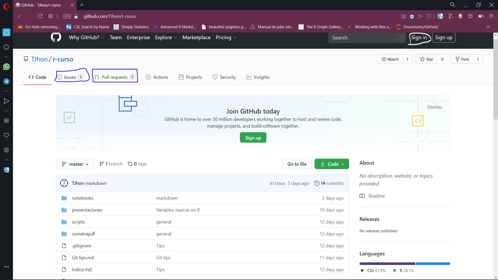

```{css echo=FALSE, eval=knitr::is_html_output()}
@media only screen and (max-width: 1000px) {
  main {
    margin: 0 1em;
  }
}
```

# R-Curso

Fecha actualizada: `r Sys.Date()`

Descripcion: Algunos recursos para el aprendizaje de R

--- 

Este es un repositorio para aprender algo de R y recomendaciones que encontre a lo largo del camino del aprendizaje de este lenguaje de programacion. 

Este curso esta un poco sesgado al uso de windows para todos los procesos, aunque muchos de estos no difieren mucho de Linux y Mac. 

Lo videos relacionados esta presentes en: 

- [Vision general y usos](https://www.youtube.com/playlist?list=PLDVZfi7ztrg5RU6xmgceV4MJ9YlE7oele)
- [Solo R](https://www.youtube.com/playlist?list=PLDVZfi7ztrg6Ob825jQ6AEYGUceKHg_fY)


## Antes de iniciar - Instalaciones Mediante `chocolatey`

**Chocolatey** para windows 10

1. Abrir powershell (Como administrador) 
1. Ejecutar el
siguiente codigo 

- Set-ExecutionPolicy Bypass -Scope Process -Force;
\[System.Net.ServicePointManager\]::SecurityProtocol =
\[System.Net.ServicePointManager\]::SecurityProtocol -bor 3072; iex
((New-Object
System.Net.WebClient).DownloadString(‘<https://chocolatey.org/install.ps1>’))

**Solo hacer lo siguiente** si confias en mi (entonces proceder a abrir mediante Rstudio y correr el documento `config.r` :

`choco install git pandoc r r.studio rtools -y`

**Git**

``` 
`choco install git -y`
```

  - [Ver videos](https://www.youtube.com/playlist?list=PLmUnyBCRHkvUPkrsseI1SmMtYgfc-f8Kn)
    - Opcional

**R y Rstudio**

 `choco install r -y`
    
`choco install r.studio -y`
    
`choco install rtools -y`  Opcional

**Paquetes iniciales**

Ver y correr `config.r`

# Se aceptan recomendaciones 

Para poder modificar, corregir, recomendar o cualquier otra cosa, para ello seguir los siguientes pasos y guiarse de la siguiente captura de pantalla:
g
```{r}

```

1. Crear una cuenta de GitHub (en la parte superior derecha)

1. Ir al [link](https://github.com/TJhon/r-curso) del curso.
  - Dar click en `Issues`, para problemas con el curso o recomendaciones. 
  - `Pull requests` para modificaciones dentro del repositorio
  
# Indice 

Para una vision general ir al [indice](https://github.com/TJhon/r-curso/blob/master/Indice.md)

# Archivos

Esta es la lista de archivos creados hasta la fecha de actualizacion, es proposito: es la simplificacion de busqueda de archivos dentro del repositorio.

```{r}

fs::dir_tree()
```

